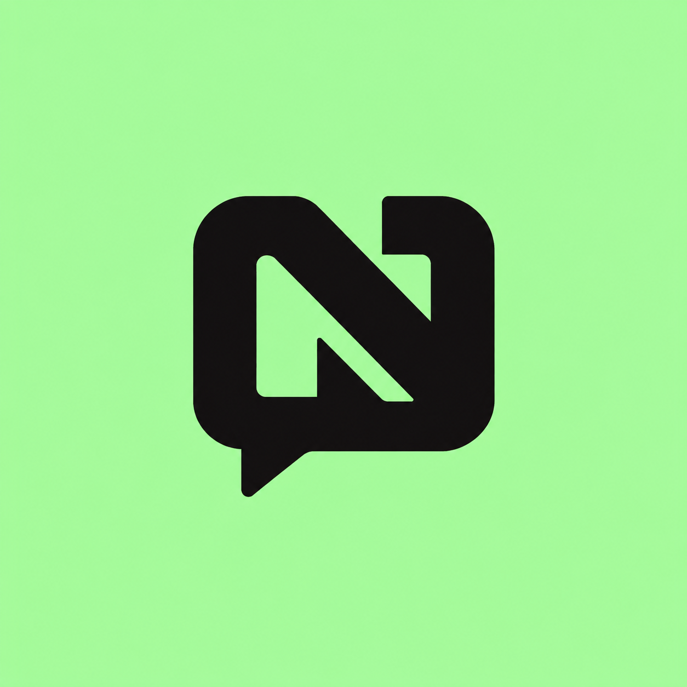

# NexaChat AI

NexaChat AI is a multi-provider mobile chat client built with Expo and React Native. It lets users bring their own API keys, switch between supported AI providers and models, and keep conversation history locally on the device.

<p align="center">
  
</p>

## Features

- Chat with OpenAI, Anthropic, and Mistral models
- Switch providers and models without creating a new chat
- Store and manage provider API keys from the app
- Create, continue, filter, and delete chats
- Copy individual messages to the clipboard
- Share individual messages or complete conversations
- Import and export chat history as JSON
- Light and dark themes
- Optional larger chat text
- Haptic feedback for common actions
- Persistent local state with Redux Persist and AsyncStorage

## Architecture

```text
React Native screens
        │
        ▼
Redux Toolkit chat state ──────> Redux Persist ──────> AsyncStorage
        │
        ├──> OpenAI REST API
        ├──> Anthropic SDK
        └──> Mistral SDK
```

NexaChat AI has no application backend. Requests are sent directly from the device to the selected provider using the API key entered by the user.

## Supported providers and models

The current source configuration includes:

| Provider | Models |
| --- | --- |
| OpenAI | `gpt-5`, `gpt-5-mini`, `gpt-5-nano` |
| Anthropic | `claude-3-5-haiku-20241022`, `claude-sonnet-4-20250514`, `claude-opus-4-1-20250805` |
| Mistral | `mistral-small-latest`, `mistral-large-latest` |

Model access depends on the provider account associated with each API key. Provider model names and availability can change independently of this project.

## Tech stack

- Expo SDK 52
- React Native 0.76
- React 18
- React Navigation
- Redux Toolkit and React Redux
- Redux Persist and AsyncStorage
- Axios
- Anthropic SDK
- Mistral SDK
- Expo Clipboard, File System, Sharing, Document Picker, and Haptics

## Getting started

### Prerequisites

- A current Node.js LTS release
- npm
- Expo Go or an Android emulator
- An API key for at least one supported provider

### Installation

```bash
git clone https://github.com/AdityaBansal0123/NexaChat-AI.git
cd NexaChat-AI
npm install
```

### Run in development

```bash
npm start
```

You can also start a platform directly:

```bash
npm run android
npm run ios
npm run web
```

After opening the app:

1. Open **Settings**.
2. Select **Providers**.
3. Open a provider and paste its API key.
4. Select the model and make that provider active.
5. Open **New Chat** to start a conversation.

## Android builds with EAS

The repository does not contain another account's EAS project ID. Associate it with your own Expo account before building:

```bash
npm install --global eas-cli
eas login
eas init
eas build -p android --profile preview
```

The Android application ID is `com.adityabansal0123.nexachat`.

## Project structure

```text
.
├── assets/                         # Application icon and splash asset
├── src/
│   ├── api/                        # OpenAI, Anthropic, and Mistral clients
│   ├── app/                        # Redux store and persistence setup
│   ├── common/utils/               # Formatting and lookup helpers
│   ├── components/                 # Headers, buttons, and modal UI
│   ├── features/chat/              # Chat state, thunks, and new-chat flow
│   ├── pages/
│   │   ├── ChatPage/               # Conversation and message input UI
│   │   ├── ConversationsPage/      # Searchable local chat history
│   │   └── SettingsPage/           # Provider and chat preferences
│   └── styles/                     # Shared light and dark color tokens
├── App.js                          # Navigation and application providers
├── app.json                       # Expo application configuration
├── eas.json                       # EAS build profiles
└── package.json
```

## Local data and security

The following information is persisted locally through Redux Persist and AsyncStorage:

- Provider API keys
- Conversation history
- Selected provider and model
- Theme and text-size preferences

AsyncStorage is not encrypted secure storage. Treat this project as a learning or personal-use client unless API keys are moved to platform-backed secure storage. Requests consume the user's provider quota and may incur charges. Never commit API keys to the repository or include them in exported chat files.

## Chat backup

Open **Settings → Chats** to:

- Export all conversations to a timestamped JSON file
- Import a previously exported conversation file
- Delete all locally stored chats
- Enable larger message text

Imported JSON must match the conversation structure expected by the application.

## Available scripts

| Command | Description |
| --- | --- |
| `npm start` | Start the Expo development server |
| `npm run android` | Open the Android target |
| `npm run ios` | Open the iOS target |
| `npm run web` | Open the web target |

## Repository

https://github.com/AdityaBansal0123/NexaChat-AI
